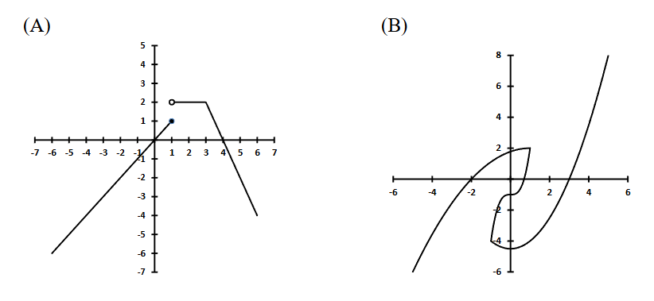
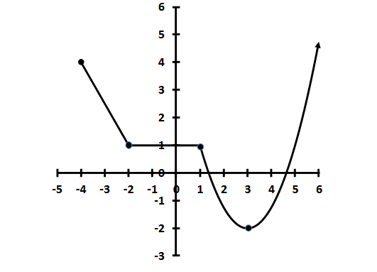
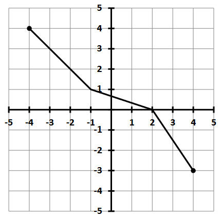
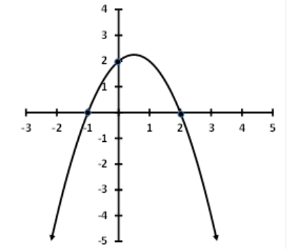

> How to use this page  
> Try each problem first, then open Hint 1, Hint 2, and the Solution only as needed. This page is a working draft, but each revised item is written to show setup, algebra, and interpretation clearly.

- [Final Exam Practice Exam Answers](#answers)

- [Math 112 final exam resources](https://www.math.arizona.edu/academics/courses/math112)

---
## Formulas Provided on the Exam  {: #formula-sheet }

### Quadratics

| Quadratic Formula                               | Vertex of Parabola                |
| :---------------------------------------------- | :-------------------------------- |
| \(x = \dfrac{-b \pm \sqrt{b^{2}-4ac}}{2a}\)     | \(x = -\dfrac{b}{2a}\)            |

**Factored Forms**  
| Form                               |
| :--------------------------------- |
| \(y = a(x-p)(x-q)\)                |
| \(y = a(x-h)^2 + k\)               |
| \(y = a(x-r_1)(x-r_2)\)            |

---

### Exponentials & Logs

| Exponential Growth / Decay                  | Logs Conversion                         |
| :-----------------------------------------  | :--------------------------------------  |
| \(A = P\!\bigl(1+\tfrac{r}{n}\bigr)^{nt}\)  | \(\log_b x = \dfrac{\ln x}{\ln b}\)      |
| \(A = P e^{rt}\)                            |                                         |

---

### Compound Interest

| Continuous Compounding                      |
| :------------------------------------------ |
| \(A = P e^{rt}\)                            |


## Problems

### 1 Sales‑Tax Expression

In a certain city, sales tax is 9 %. Write an expression for the total cost of an item priced \(x\) dollars after tax is added.

A. \(C(x)=1.09x\)  

B. \(C(x)=0.09x\)  

C. \(C(x)=1.9x\)  

D. \(C(x)=9x\)  

E. \(C(x)=0.91x\)

<details><summary><strong>Hint 1: Start here</strong></summary>
What does “9% sales tax” mean in terms of the original price \(x\): what amount is tax, and what amount is total cost? 
</details>

<details><summary><strong>Hint 2: Idea and first steps</strong></summary>
Tax is \(0.09x\). Add that to the original price \(x\):
\[
C(x)=x+0.09x.
\]
Now simplify and match the choice.
</details>

<details><summary><strong>Solution</strong></summary>
9 % of \(x\) is \(\frac{9}{100}x=0.09x\), so total cost is
\[
C(x)=x+0.09x=1.09x.
\]
This matches choice A.
</details>

---

### 2 Which Graph is a Function?


<details><summary><strong>Hint 1: Start here</strong></summary>
What must be true for a graph to represent a function: can one input \(x\) produce more than one output \(y\)?
</details>

<details><summary><strong>Hint 2: Idea and first steps</strong></summary>
Use the vertical-line test. If any vertical line hits the graph more than once, the relation is not a function.
</details>

<details><summary><strong>Solution</strong></summary>
Graph A passes the vertical‑line test, so only Graph A is a function.
</details>

---

### 3 Domain of \(R(x)=\sqrt{2-5x}\)


A. \([0.4,\infty)\)

B. \((-\infty,0.4]\)

C. \((0.4,\infty)\)

D. \((-\infty,0.4)\)

E. \([0,\infty)\)

<details><summary><strong>Hint 1: Start here</strong></summary>
For a square-root function, what condition must the radicand satisfy, and which inequality should you solve here?
</details>

<details><summary><strong>Hint 2: Idea and first steps</strong></summary>
Set the inside expression to be nonnegative:
\[
2-5x\ge 0.
\]
Solve that inequality and write the result in interval notation.
</details>

<details><summary><strong>Solution</strong></summary>
The expression inside a square root must be nonnegative, so we require
$$2-5x \geq 0.$$
Now solve for \(x\): 
$$\begin{align*}
2 & \geq 5x \\
\frac{2}{5} &\geq x
\end{align*}$$
Hence the domain is
\[
(-\infty,\tfrac{2}{5}].
\]
This can also be written as \(( -\infty,0.4 ]\), which matches choice B.
</details>

---

### 4 Intervals of Increase




A. \((-\infty,3)\)

B. \((-\infty,0)\)

C. \((0,3)\)

D. \([3,\infty)\)

E. \((0,3)\cup(3,\infty)\)

<details><summary><strong>Hint 1: Start here</strong></summary>
On which interval(s) does the graph rise as you move left to right, and how do you express that using interval notation?
</details>

<details><summary><strong>Hint 2: Idea and first steps</strong></summary>
Scan the curve from left to right and mark where the function values increase. Then match that interval to the answer choices.
</details>

<details><summary><strong>Solution</strong></summary>
From the sketch, the function rises for all \(x \ge 3\). Therefore, the increasing interval is
\[
[3,\infty),
\]
which matches choice D.
</details>

---
### 5 Starbucks — Slope & Interpretation  

| Year | Locations |
|-----:|----------:|
| 2012 | 18 066 |
| 2014 | 21 366 |
| 2015 | 23 016 |

What is the slope of the line that passes through these points, **and what does it mean in practical terms?**

A. \(m = 3300\). The number of Starbucks locations worldwide increases by **3300 per year**.  

B. \(m = 3300\). The number of locations increases by **3300 over 3 years**.  

C. \(m = 4950\). The number of locations increases by **4950 per year**.  

D. \(m = 1650\). The number of locations increases by **1650 over 3 years**.  

E. \(m = 1650\). The number of locations worldwide increases by **1650 per year**.  

<details><summary><strong>Hint 1: Start here</strong></summary>
What does slope measure in this table context: change in locations, change in years, or both?
</details>

<details><summary><strong>Hint 2: Idea and first steps</strong></summary>
Use two data points and compute
\[
m=\frac{\Delta y}{\Delta x}=\frac{\text{change in locations}}{\text{change in years}}.
\]
Then interpret the unit as locations per year.
</details>

<details><summary><strong>Solution</strong></summary>

Slope  
\[
m=\frac{23\,016-18\,066}{2015-2012}=\frac{4965}{3}=1650.
\]

Thus Starbucks was adding **about 1650 locations each year** over the period shown.  
**Answer E.**
</details>


---

### 6 Linear Model for Starbucks Locations

Which linear function best models the number of Starbucks locations \(S(t)\) as a function of time \(t\) in years since 2012?


A. \(S(t)=1650t+18\,066\)  

B. \(S(t)=3300t+18\,066\)  

C. \(S(t)=4950t+18\,066\)  

D. \(S(t)=1650t+21\,366\)  

E. \(S(t)=3300t+21\,366\)

<details><summary><strong>Hint 1: Start here</strong></summary>
For a linear model \(S(t)=mt+b\), which two pieces of information from the table identify \(m\) and \(b\)?
</details>

<details><summary><strong>Hint 2: Idea and first steps</strong></summary>
Use the slope from the previous problem for \(m\), and use the value at \(t=0\) (year 2012) for \(b\).
</details>

<details><summary><strong>Solution</strong></summary>
At \(t=0\) (year 2012), \(S(0)=18\,066\), so this is the initial value (the \(y\)-intercept).
Slope \(m=1650\) locations per year.
\[
S(t)=1650t+18\,066\]
So the linear model is \(S(t)=1650t+18\,066\), which is choice A.
</details>

---

### 7 Evaluate the Piecewise Function

\[
f(x)=
\begin{cases}
2x+5 & x<-2\\[2pt]
x-1 & -2\le x\le1\\[2pt]
\tfrac13x+4 & x>1
\end{cases}
\]

Evaluate \(f(-3)\).

A. 3 B. –1 C. –4 D. 1 E. undefined

<details><summary><strong>Hint 1: Start here</strong></summary>
In which branch does \( x= -3 \) fall?
Use corresponding formula to compute \(f(-3)\).
</details>

<details><summary><strong>Hint 2: Idea and first steps</strong></summary>
Because \(-3<-2\), use the first piece \(f(x)=2x+5\). Substitute \(x=-3\) and simplify.
</details>

<details><summary><strong>Solution</strong></summary>
Since \(-3<-2\), use the first branch:
\[
f(-3)=2(-3)+5=1.\]
So \(f(-3)=1\), which matches choice D.

</details>

---

### 8 (*) Transformations of \(g(x)\)

If \((2,5)\) lies on \(y=g(x)\), which point must lie on  
\(y = 2g\!\left(\tfrac{x}{5}\right)+3\)?

A. \(\bigl(\tfrac25,13\bigr)\)  
B. \((4,4)\)  
C. \((10,13)\)  
D. \(\bigl(\tfrac{11}{10},2\bigr)\)  
E. \((4,13)\)

<details><summary><strong>Hint 1: Start here</strong></summary>

What happens to the input and output of the known point \((2,5)\) under the transformations in \(y=2g(x/5)+3\)?
</details>

<details><summary><strong>Hint 2: Idea and first steps</strong></summary>
For \(g(x/5)\), make \(x/5=2\) to find the new input. Then transform the output with \(2(5)+3\).
</details>

<details><summary><strong>Solution</strong></summary>
1.  To send the old input \(2\) through \(x/5\), set \(\frac{x}{5}=2\) ⇒ \(x=10\).  
2.  The original output is \(g(2)=5\).  Then
   \[
     y = 2\cdot5 + 3 = 13.
   \]
Hence the image is  
\[
\boxed{(10,13)}.
\]
</details>
---

### 9 Fuel‑Efficiency Scaling

\(d=f(x)\) gives distance (mi) for \(x\) gallons of gas. Point \((10,250)\) is on the graph.  
In five years the same car travels twice as far per gallon. Which point lies on the new graph?

A. \((20,250)\)

B. \((20,500)\)

C. \((10,125)\)  

D. \((10,500)\)

 E. \((20,125)\)


<details><summary><strong>Hint 1: Start here</strong></summary>
Identify input and output of the function.
Which point is scaled by a factor of 2?
</details>

<details><summary><strong>Hint 2: Idea and first steps</strong></summary>
Originally \(10\) gal ⇒ \(250\) mi.  Doubling fuel efficiency means the same \(10\) gal ⇒ \(2\times250=500\) mi.  
\[
\boxed{(10,500)}.
\]
</details>

---

### 10. (***) Composition of Rational Functions

Consider the functions

\[
f(x) = \frac{x - 1}{x}
\qquad\text{and}\qquad
g(x) = \frac{x - 2}{x + 5}.
\]

Find \((f\circ g)(x)\).

A. \(\displaystyle (f\circ g)(x) = -\frac{7}{x^{2} + 5x}\)

B. \(\displaystyle (f\circ g)(x) = \frac{x^{2} - 3x + 2}{x^{2} + 5x}\)  

C. \(\displaystyle (f\circ g)(x) = -\frac{x - 1}{6x - 1}\)  

D. \(\displaystyle (f\circ g)(x) = -\frac{x - 1}{x^{2} + 5x}\)  

E. \(\displaystyle (f\circ g)(x) = -\frac{7}{x - 2}\)

---


<details><summary><strong>Hint 1: Start here</strong></summary>
Identify the inner and outer functions:  
\[
(f\circ g)(x) = f\bigl(g(x)\bigr).
\]
First compute \(g(x)\), then substitute that result into \(f\).
</details>


<details><summary><strong>Hint 2: Idea and first steps</strong></summary>
Once you substitute \(g(x)\) into \(f\), simplify the complex fraction carefully by multiplying numerator and denominator by \(x+5\).
</details>

<details><summary><strong>Solution</strong></summary>
\[
(f\circ g)(x)
= \frac{g(x)-1}{g(x)}
\quad\text{with}\quad
g(x)=\frac{x-2}{x+5}.
\]
\[
\begin{aligned}
\frac{g(x)-1}{g(x)}
&= \frac{\dfrac{x-2}{x+5}-1}
       {\dfrac{x-2}{x+5}}\\
&= \frac{\dfrac{x-2}{\cancel{x+5}} - \dfrac{x+5}{\cancel{x+5}}}
       {\dfrac{x-2}{\cancel{x+5}}}\\
&= \frac{x-2-(x+5)}{x-2}\\
&= \frac{-7}{x-2}
\end{aligned}
\]
</details>


--- 
### 11 (*) Coupon Order Matters

Kohl’s allows customers to use both a “\$10 off” coupon and a “30 % off” coupon on the same transaction, but the store stipulates that the “dollar off” coupon **must** be used first.  

Define  
\[
f(x) = x - 10
\quad\text{and}\quad
g(x) = 0.70x.
\]
Which of the following functions represents the final price after applying **first** the \(\$10\)‑off coupon and **then** the 30 %‑off coupon?

A. \((g\circ f)(x)\)  
B. \((f\circ g)(x)\)  
C. \((f\cdot g)(x)\)  
D. \((f+g)(x)\)  
E. \((g-f)(x)\)

<details><summary><strong>Hint 1: Start here</strong></summary>  
If one coupon must be applied first, which composition reflects the order “first \(f\), then \(g\)”?  
</details>

<details><summary><strong>Hint 2: Idea and first steps</strong></summary>
Start with \(f(x)=x-10\), then apply \(g\) to that result:
\[
g(f(x))=0.70(x-10).
\]
Choose the option with that order.
</details>

<details><summary><strong>Solution</strong></summary>  
We want to subtract \(\$10\), then take 70 % of the remainder. That is
\[
(g\circ f)(x)
= g\bigl(f(x)\bigr)
= 0.70\bigl(x - 10\bigr).
\]
None of the other orders or operations matches this.  
Hence the correct answer is **A. \((g\circ f)(x)\)**.
</details>
---


### 12 (*) Inverse Function

Find \(f^{-1}(x)\) for \(f(x)=\dfrac{x-1}{2x+3}\).

A. \(f^{-1}(x) = \dfrac{2x+3}{x-1}\)  

B. \(f^{-1}(x) = \dfrac{-3x-1}{2x-1}\)  

C. \(f^{-1}(x) = \dfrac{x+4}{2x+3}\)  

D. \(f^{-1}(x) = \dfrac{-x+1}{x+2}\)  

E. None of these

<details><summary><strong>Hint 1: Start here</strong></summary>
What is the standard first step for finding an inverse function algebraically after writing \(y=f(x)\)?
</details>

<details><summary><strong>Solution</strong></summary>
Start with
\[
y = \dfrac{x-1}{2x+3} \implies y(2x+3) = x-1 \implies 2xy + 3y = x - 1\]
Put all \(x\) terms on one the same side and factor out \(x\):
\[
x - 2xy = 3y + 1 \implies x(1-2y) = 3y + 1 \implies x = \dfrac{3y+1}{1-2y}
\]
Now switch \(x\) and \(y\):
\[
f^{-1}(x) = \dfrac{3x+1}{1-2x}\]
So
\[
f^{-1}(x)=\frac{3x+1}{1-2x}=\frac{-3x-1}{2x-1},
\]
which matches choice B.
</details>

---

### 13 (*) Evaluate \(f^{-1}(2)\) from a Graph




A. 0
B. 2
C. –2
D. Undefined
E. None of these

<details><summary><strong>Hint 1: Start here</strong></summary>
\(g(3) =2\)  means when the input is 3, the output is 2.
The inverse function \(g^{-1}(2)\) asks: what is the input that gives an output of 2?
</details>

<details><summary><strong>Hint 2: Idea and first steps</strong></summary>
Look on the graph for the point whose \(y\)-value is 2. Its \(x\)-value is exactly \(g^{-1}(2)\).
</details>

<details><summary><strong>Solution</strong></summary>
The graph shows that \(g(-2)=2\), so the inverse function \(g^{-1}(2)=-2\).
So the input that produces output 2 is \(-2\), which is choice C.
</details>

---

### 14 Find a Quadratic from a Graph



A. \(y=(x+1)(x-2)\)

B. \(y=-(x+1)(x-2)\)

C. \(y=(x-2)(x-1)\)  

D. \(y=-(x-2)(x-1)\)

E. \(y=-(x+1)(x-2)-\)

<details><summary><strong>Hint 1: Start here</strong></summary>
Which x-intercepts can you read from the graph, and does the parabola open upward or downward?
</details>

<details><summary><strong>Hint 2: Idea and first steps</strong></summary>
Write \(y=A(x-r_1)(x-r_2)\) using the intercepts. Then substitute one known point on the graph to solve for \(A\).
</details>

<details><summary><strong>Solution</strong></summary>
Observe the \(y=0\) when \(x=-1\) or \(x=2\).
Thus the factored form is
\[
y = A(x+1)(x-2).\]
Now we evaluate the formula above at the point (0,2) to find \(A\):
\[
2 = A(0+1)(0-2) \implies 2 = -2A \implies A = -1.\]
So the equation is
\[
y = -(x+1)(x-2).\]
Thus the matching equation is \(y=-(x+1)(x-2)\), choice B.
</details>

---

### 15 Time for Projectile to Land

A stone’s height (m) after \(t\) s:  
\(h(t)=-4.9t^{2}+49t+277.4\). When does it hit the ground?

A. < 9 s

B. 9–11 s

C. 11–13 s

D. 13–15 s

E. > 15 s

<details><summary><strong>Hint 1: Start here</strong></summary>
What does “hits the ground” mean for height \(h(t)\), and which equation in \(t\) should that create?
</details>

<details><summary><strong>Hint 2: Idea and first steps</strong></summary>
Set \(h(t)=0\), solve the quadratic, and keep only the nonnegative time because negative time is not physically meaningful.
</details>


<details><summary><strong>Solution: Calculator version </strong></summary>

There are two ways to solve this problem with a calculator.

**Version 1**: program > quad > "asks you for a? b? c? > gives you the roots.

**Version 2:**

1. **Press** `Y=`
2. **Enter** your quadratic, e.g.

   ```
   Y1 = A·X² + B·X + C
   ```
3. **Press** `GRAPH`
4. **Press** `2nd` → `CALC`
5. **Select** `2: Zero`
6. **Left Bound?** Move the cursor to just left of the root and press `ENTER`
7. **Right Bound?** Move the cursor to just right of the root and press `ENTER`
8. **Guess?** Just press `ENTER` — the calculator will display the root.

</details>


<details><summary><strong>Solution</strong></summary>
Set \(h(t)=0\):
\[
0=-4.9t^{2}+49t+277.4\]
Use the quadratic formula:
\[
t=\dfrac{-49\pm\sqrt{49^{2}-4(-4.9)(277.4)}}{2(-4.9)}\]
\[
t=\dfrac{-49\pm\sqrt{2401+5443.76}}{-9.8}\]
\[
t=\dfrac{-49\pm\sqrt{7844.76}}{-9.8}\]
\[
t=\dfrac{-49\pm88.6}{-9.8}\]
\[
t=\dfrac{-49+88.6}{-9.8}\approx-4.02\text{ (not valid)}\]
\[
t=\dfrac{-49-88.6}{-9.8}\approx14.05\text{ (valid)}\]
So the stone hits the ground at about \(t=14\) seconds.
This places the time in the interval 13-15 seconds, so the correct choice is D.
</details>


---

### 16 (*) Profit Maximization

Demand: \(p(x)=50-\dfrac{1}{4000}x\). Fixed cost \$25 000; variable \$3 per pair.  
How many sunglasses maximize profit?

A. 100 000

B. 87 000

C. 94 000

D. 200 000
 
E. 188 000

<details><summary><strong>Hint 1: Start here</strong></summary>
Which quantity should be maximized, and how do revenue and cost combine to produce that function?
</details>
<details><summary><strong>Hint 2: Idea and first steps</strong></summary>
Write \(R(x)=x\,p(x)\), then \(P(x)=R(x)-C(x)\). After simplifying, use the vertex of the quadratic profit model to find the maximizing \(x\).
</details>
<details><summary><strong>Solution</strong></summary>
Revenue: \[
R(x)=p(x)x=(50-\dfrac{1}{4000}x)x=50x-\dfrac{1}{4000}x^{2}\]
Cost: \[
C(x)=25000+3x\]
Profit: \[
P(x)=R(x)-C(x)=\left(50x-\dfrac{1}{4000}x^{2}\right)-(25000+3x)\]
\[
P(x)=-\dfrac{1}{4000}x^{2}+47x-25000\]
This is a downward-opening parabola. The maximum occurs at the vertex:
\[
x=-\dfrac{b}{2a}=-\dfrac{47}{2(-\dfrac{1}{4000})}=47\cdot2000=94000.\]
Thus the maximum profit occurs at \(x=94\,000\) pairs.
So the maximizing production level is 94,000 pairs, which is choice C.
</details>


### 17 Facebook Users Model

The number of monthly active Facebook users worldwide (in millions) between 2009 and 2017 is modeled by  
\[
f(t)=2.12\,t^3 \;-\;27.43\,t^2 \;+\;301.48\,t \;+\;180.4,
\]
where \(t\) is years since 2009. Use this model to answer the next question.

**17.** Evaluate \(f(1)\) and give a practical interpretation.

A. \(f(1)=456.57\). In the year 2010, there were an average of 456.57 Facebook users added each month.  
B. \(f(1)=456.57\). In the year 2010, there were 456.57 monthly Facebook users.  
C. \(f(1)=456.57\). In the year 2010, there were 456.57 million monthly Facebook users.  
D. \(f(1)=456.57\). In the year 2010, there were an average of 456.57 million Facebook users added each month.  
E. \(f(1)=456.57\). To reach 1 million monthly Facebook users, it took 456.57 months.

<details><summary><strong>Hint 1: Start here</strong></summary>
If \(t\) is years since 2009, what calendar year does \(t=1\) represent, and what units does \(f(t)\) use?
</details>

<details><summary><strong>Hint 2: Idea and first steps</strong></summary>
Evaluate \(f(1)\) directly, then interpret the numerical result in **millions of monthly active users**.
</details>

<details><summary><strong>Solution</strong></summary>
\[
f(1)
=2.12(1)^3 -27.43(1)^2 +301.48(1) +180.4
=456.57.
\]
Since \(f\) measures millions of users, \(456.57\) means **456.57 million monthly active users** in 2010.  
**Answer C.**
</details>

---

### 18 (***) When Did Users Reach 1 Billion?

According to this model, in what year did the number of monthly active Facebook users reach 1 000 million?

A. 2011 B. 2012 C. 2013 D. 2014 E. 2015

<details><summary><strong>Hint 1: Start here</strong></summary>
What equation represents “reaches 1000 million users,” and how do you convert the resulting \(t\)-value into a calendar year?
</details>

<details><summary><strong>Hint 2: Idea and first steps</strong></summary>
Solve
\[
2.12t^3-27.43t^2+301.48t+180.4=1000
\]
with a calculator, then add the decimal \(t\)-value to 2009 and choose the nearest year option.
</details>

<details><summary><strong>Solution</strong></summary>
Using a calculator to solve
\[
2.12t^3-27.43t^2+301.48t+180.4=1000,
\]
we get \(t\approx 3.55\).

Since \(t\) is years after 2009, the year is
\[
2009+3.55\approx 2012.55,
\]
which corresponds to **2012** among the choices.

**Answer B.**

</details>

---

### 19 Factor \(R(x)\) Given a Root

Graph  
\[
R(x)=2x^3 + 5x^2 - 6x - 1
\]
on your calculator. Given that \((x-1)\) is a factor, what are the other linear factors?

A. \((2x+3)\) and \((x+2)\)  

B. \((2x-3)\) and \((x-2)\)  

C. \((3x+1)\) and \((x-3)\)  

D. \((3x-1)\) and \((x+3)\)  

E. \((2x+1)\) and \((x+6)\)

<details><summary><strong>Hint 1: Start here</strong></summary>
Given one known factor \((x-1)\), what should you do next to find the remaining linear factors?
</details>
<details><summary><strong>Hint 2: Idea and first steps</strong></summary>
Divide by \((x-1)\) to get a quadratic, then solve that quadratic (by factoring or graphing) to get the other roots.
</details>


<details><summary><strong>Solution</strong></summary>
Graph the quotient
\[
\frac{2x^3 + 5x^2 - 6x - 1}{x-1}
\]
and find where it intersects \(y=0\). 

The roots are \(x=-2\) and \(x=\frac{-3}{2}\).
Therefore, the remaining linear factors are \((2x+3)\) and \((x+2)\), which is choice A.

Verify by reconstruction:
\[
R(x)=(x-1)(2x+3)(x+2).
\]
\[ 
\text{Verify: } R(-2) = 0 \text{ and } R\left(-\frac{3}{2}\right) = 0
\] 
</details>


### 20 End Behavior of \( f(t)=\dfrac{6t}{t + 1.2} \)

As \(t\) gets very large, what does \(f(t)\) approach?

A. \(f(t)\to\infty\)  

B. \(f(t)\to1.2\)  

C. \(f(t)\to3.8\)  

D. \(f(t)\to6\)  

E. None of these  


<details><summary><strong>Hint 1: Start here</strong></summary>  
For a rational function, what determines the horizontal asymptote when numerator and denominator have the same degree?
</details>

<details><summary><strong>Hint 2: Idea and first steps</strong></summary>
Compare the leading terms \(6t\) and \(t\). Their coefficient ratio gives the long-run value.
</details>

<details><summary><strong>Solution</strong></summary>  
The leading terms are \(6t\) and \(t\), so as \(t\to\infty\), 

\[
\lim_{t\to\infty}\frac{6t}{t+1.2}
=\lim_{t\to\infty}\frac{6}{1 + \tfrac{1.2}{t}}
=6.
\]  
\[
\boxed{6}.
\]  
**Answer D.**  
</details>

---

### 21 (\*\*\*) Evaluate \(h^{-1}(5)\) and Interpret

The height (ft) of a dwarf evergreen tree after \(t\) years is

$$
h(t) = \frac{6t}{1.2 + t}.
$$

Find \(h^{-1}(5)\), i.e.\ the time \(t\) when the tree reaches 5 ft.


A. \(h^{-1}(5)=4.84\). When a tree is 5 ft tall, 4.84 years have passed.

B. \(h^{-1}(5)=1.2\). When a tree is 5 ft tall, 1.2 years have passed.

C. \(h^{-1}(5)=6\). When a tree is 5 ft tall, 6 years have passed.

D. \(h^{-1}(5)=4.84\). After 5 years, the height is 4.84 ft.

E. \(h^{-1}(5)=6\). After 5 years, the height is 6 ft.

<details><summary><strong>Hint 1: Start here</strong></summary>  
What does \(h^{-1}(5)\) ask for in words: an input time or an output height?  
</details>

<details><summary><strong>Hint 2: Idea and first steps</strong></summary>
Set \(h(t)=5\), solve for \(t\), and interpret the result as the number of years needed for the tree to reach 5 feet.
</details>

<details><summary><strong>Solution</strong></summary>  
We want \(t\) such that  
\[
\frac{6t}{1.2 + t} = 5.
\]  
Multiply both sides by \(1.2+t\), distribute, and isolate \(t\):

$$
\begin{aligned}
6t &= 5(1.2 + t) &&\bigl|\times(1.2+t)\\
6t &= 6 + 5t      &&\bigl|\,-5t\\
6t - 5t &= 6\\
t &= 6.
\end{aligned}
$$

Thus \(h^{-1}(5)=6\), meaning **when the tree reaches 5 ft tall, 6 years have passed**.

$$
\boxed{6}.
$$

Choice **C**.

</details>

---


### 22 (***) Horizontal Asymptote of \(\displaystyle p(x)=\frac{2-3x}{x+1}\)

A. \(y=-3\)

B. \(y=2\)

C. \(y=\tfrac23\)  

D. \(y=\tfrac32\) 

E. \(y=-1\)

<details><summary><strong>Hint 1: Start here</strong></summary>
When numerator and denominator have the same degree, what is the horizontal asymptote rule?
</details>

<details><summary><strong>Hint 2: Idea and first steps</strong></summary>
Use the ratio of leading coefficients: \(-3/1\). That value is the horizontal asymptote.
</details>

<details><summary><strong>Solution</strong></summary>
As \(x\to\pm\infty\), \(\frac{2-3x}{x+1}\to\frac{-3x}{x}=-3\).  
**Answer A.**
</details>

---

### 23 Range of \(\displaystyle p(x)= \left( \frac{1}{3} \right)^x +2\)

A. \([2,\infty)\)

B. \((-\infty,2]\)  

C. \((-\infty,2)\) 

D. \((-\infty,\infty)\)  

E. \((2,\infty)\)

<details><summary><strong>Hint 1: Start here</strong></summary>
The function \((\tfrac13)^x\) is always positive. What does that tell you about the range of \(p(x)\)?
What happens if \(x\) is very large or very small, negative?

</details>

<details><summary><strong>Hint 2: Idea and first steps</strong></summary>
Because \((1/3)^x>0\), adding 2 shifts all outputs up by 2. Determine whether 2 is included by checking if \((1/3)^x\) can ever equal 0.
</details>

<details><summary><strong>Solution</strong></summary>
Since \((\tfrac13)^x>0\) for all real \(x\),
\[
(\tfrac13)^x\in(0,\infty)
\quad\Longrightarrow\quad
p(x)=(\tfrac13)^x+2\in(2,\infty).
\]
\[
\boxed{(2,\infty)}.
\]  
**Answer E.**
</details>

---

### 24 (***) Find \(C\) and \(b\) for \(y = C\,b^x\)

| \(x\) | 1 | 2 | 3 | 4 |
|:-----:|--:|---:|---:|---:|
| \(y\) |  8 | 12 | 18 | 27 |


A. \(C=3,\;b=2\)  

B. \(C=\tfrac{16}{3},\;b=\tfrac23\)  

C. \(C=8,\;b=\tfrac23\)  

D. \(C=\tfrac{16}{3},\;b=\tfrac32\)  

E. \(C=8,\;b=\tfrac32\)

<details><summary><strong>Hint 1: Start here</strong></summary>
How can two rows of the table give you two equations in the two unknowns \(C\) and \(b\)?
</details>

<details><summary><strong>Hint 2: Idea and first steps</strong></summary>
Use \(x=1\) and \(x=2\):
\[
Cb=8,\qquad Cb^2=12.
\]
Divide the second equation by the first to solve for \(b\), then back-substitute for \(C\).
</details>

<details><summary><strong>Solution</strong></summary>
First evaluate the function at \(x=1\):
\[
y(1)=C b^1\]
This gives us the equation
\[
8 = C b.\]
We can solve for \(C\):
\[
C = \frac{8}{b}.\]
Next evaluate the function at \(x=2\):
\[
y(2)=C b^2\]
This gives us the equation
\[
12 = C b^2.\]

Since we know \(C\), we can substitute:
\[
12 = \left(\frac{8}{b}\right) b^2
\]
Cancel one factor of \(b\):
\[
12 = 8b\]
Hence
\[
b = \frac{12}{8} = \frac{3}{2}.\]
Now substitute \(b\) back into the equation for \(C\):
\[
C = \frac{8}{b} = \frac{8}{\frac{3}{2}} = \frac{16}{3}.\]   
So \(C=\frac{16}{3}\) and \(b=\frac{3}{2}\), which matches choice D.
</details>

---

### 25 Continuous Compounding

Arturo wants \$15 000 in 6 years with continuous compounding at 3.7 % Continuously compounded. How much must he invest now?

A. \$12 061.98

B. \$1 629.14  

C. \$138 109.96

D. \$18 728.57  

E. \$12 013.73

<details><summary><strong>Hint 1: Start here</strong></summary>
Which variable is unknown in \(A=Pe^{rt}\): the future amount \(A\), the principal \(P\), or the rate \(r\)?
</details>

<details><summary><strong>Hint 2: Idea and first steps</strong></summary>
Substitute \(A=15000\), \(r=0.037\), and \(t=6\), then isolate \(P\) by dividing both sides by \(e^{rt}\).
</details>

<details><summary><strong>Solution</strong></summary>
We want to solve for \(P\) in the equation
\[
A=Pe^{rt}\]
 with data given \(A=15000\), \(r=\frac{3.7}{100}=0.037\), and \(t=6\):
\[
15000=Pe^{0.037\cdot6}\]
\[
P=\frac{15000}{e^{6(0.037)}}\approx\frac{15000}{e^{0.222}}=\frac{15000}{1.248}\approx12013.73.\]
So the required initial investment is approximately \(\$12{,}013.73\), choice E.
**Answer E.**
</details>

---

### 26 Population Prediction

A city’s population is \(P(t)=12500e^{0.02t}\), where \(t\) is years after 1985. Predict in 2020.


A. < 10 000  

B. 10 000–20 000  

C. 20 000–30 000  

D. 30 000–40 000  

E. > 40 000

<details><summary><strong>Hint 1: Start here</strong></summary>
If \(t\) counts years after 1985, what \(t\)-value corresponds to the year 2020?
</details>

<details><summary><strong>Hint 2: Idea and first steps</strong></summary>
Compute \(t=2020-1985\), then evaluate \(P(t)=12500e^{0.02t}\) and compare with the answer intervals.
</details>

<details><summary><strong>Solution</strong></summary>
In 1985, \(t=0\). In 2020, \(t=35\).
Substituting \(t=35\) into the population formula:

\[
P(35)=12500\,e^{0.7}\approx12500\times2.0138\approx25\,171,
\]
which lies between 20 000 and 30 000.  
**Answer C.**
</details>


### 27 Evaluate \(\log_{2}\!\bigl(\tfrac18\bigr)\)

A. \(\tfrac13\) B. \(-3\) C. \(\tfrac14\) D. \(-4\) E. 0

<details><summary><strong>Hint 1: Start here</strong></summary>
What exponent on 2 gives \(1/8\), and how does that connect to the definition of \(\log_2\)?
</details>

<details><summary><strong>Hint 2: Idea and first steps</strong></summary>
Write \(\tfrac18=2^{-3}\), then use \(\log_2(2^k)=k\).
</details>


<details><summary><strong>Solution</strong></summary>
\(\tfrac18=2^{-3}\), so
\[
\log_{2}\!\bigl(\tfrac18\bigr)=\log_{2}\!\bigl(2^{-3}\bigr)=-3.\]
Thus \(\log_2(1/8)=-3\), which is choice B.
**Answer B.**
</details>

---

### 28 Rewrite \(6^{N}=13\) in Logarithmic Form


A. \(\log_{6}13 = N\)  

B. \(\log 6 = 13^{N}\)  

C. \(\log_{13}6 = N\)  

D. \(\log_{13}6 = N\)  

E. \(\log_{6}13 = N\)
<details><summary><strong>Hint 1: Start here</strong></summary>
In the equation \(6^N=13\), which number is the base and which number is the result?
</details>

<details><summary><strong>Hint 2: Idea and first steps</strong></summary>
Use the conversion rule \(a^b=c \iff \log_a(c)=b\). Match \(a=6\), \(b=N\), and \(c=13\).
</details>

<details><summary><strong>Solution</strong></summary>
Remember the definition of logarithm with base \(b\):
\[
\log_{b}(x)\]
asks to what number do we raise \(b\) to get \(x\)?
so to put this in logarithm form it makes sense to use base 6.
and recast the equation \(6^{N}=13\) as
\[
\log_{6} 6^{N} = \log_{6} 13\]
The logarithm is the inverse of the exponentiation, so we can cancel the \(6\) on the left side
to obtain.
\[
N = \log_{6} 13.\]  
So the logarithmic form is \(\log_6(13)=N\). In the listed options, this is labeled as choice E.
</details>

---

### 29 Solve \(\log_{2}(3)=\log_{2}(5x)-\log_{2}(x+1)\)

A. \(x=\tfrac12\) B. \(x=\tfrac14\) C. \(x=\tfrac32\) D. \(x=\tfrac38\)

<details><summary><strong>Hint 1: Start here</strong></summary>
When two logs with the same base are subtracted, what single-log expression can you write?
</details>  
<details><summary><strong>Hint 2: Idea and first steps</strong></summary>
Combine the right side first, then use one-to-one behavior of logarithms to solve the resulting rational equation.
</details>
<details><summary><strong>Solution</strong></summary>
Combine logs:
\[
\log_{2}(3)=\log_{2}\!\left(\frac{5x}{x+1}\right).\]
Exponentiate both sides:
\[
3 = \frac{5x}{x+1}.\]
Multiply both sides by \(x+1\):
\[
3(x+1) = 5x.\]
Distribute:
\[
3x + 3 = 5x.\]
Subtract \(3x\) from both sides:
\[
3 = 5x - 3x\]
\[
3 = 2x.\]
Divide both sides by \(2\):
\[
x = \frac{3}{2}.\]
Thus the solution is \(x=\frac{3}{2}\), which matches choice C.
**Answer C.**
</details>

---

### 30 Solve for \(t\)

$$
140\Bigl(\tfrac12\Bigr)^{t/4} = 350
$$

A. \(t = 4\log_{1/2}(5)\)

B. \(t = 4\log_{1/2}\!(\tfrac52)\)

C. \(t = 4\log_{5/2}(\tfrac12)\)

D. \(t = 4\log_{5}(2)\)

<details><summary><strong>Hint 1: Start here</strong></summary>
After isolating the exponential expression, which logarithm base matches the answer choices most directly?
</details>

<details><summary><strong>Hint 2: Idea and first steps</strong></summary>
First divide by 140 to get \((1/2)^{t/4}=5/2\). Then convert to logarithmic form to solve for \(t\).
</details>

<details><summary><strong>Solution</strong></summary>

We want to solve

$$
140\Bigl(\tfrac12\Bigr)^{t/4} = 350.
$$

Divide both sides by 140:

$$
\Bigl(\tfrac12\Bigr)^{t/4} = \frac{350}{140} = \frac{5}{2}.
$$

Now take logarithms in base $\tfrac12$:

$$
\frac{t}{4}
= \log_{1/2}\!\Bigl(\tfrac{5}{2}\Bigr)
\quad\Longrightarrow\quad
t = 4\,\log_{1/2}\!\Bigl(\tfrac{5}{2}\Bigr).
$$

That matches choice **B**.

</details>

**Answer B.**


### 31 Solve  \( \displaystyle \frac{8}{1 + 100e^{-3t}} = 2\)

A. \(\displaystyle t = -\ln\!\bigl(\tfrac{1}{100}\bigr)\)

B. \(\displaystyle t = \tfrac{1}{3}\ln\!\bigl(\tfrac{1}{20}\bigr)\)

C. \(\displaystyle t = -\ln\!\bigl(\tfrac{3}{20}\bigr)\)

D. \(\displaystyle t = -3\ln\!\bigl(\tfrac{3}{100}\bigr)\)

E. \(\displaystyle t = -\tfrac{1}{3}\ln\!\bigl(\tfrac{3}{100}\bigr)\)

<details><summary><strong>Hint 1: Start here</strong></summary>
What should your first algebra step be to remove the denominator and create a linear equation in the exponential term?
</details>

<details><summary><strong>Hint 2: Idea and first steps</strong></summary>
Clear the denominator, isolate \(e^{-3t}\), then take \(\ln\) and solve for \(t\).
</details>

<details><summary><strong>Solution</strong></summary>

We want \(t\) such that

$$
\frac{8}{1 + 100e^{-3t}} = 2.
$$

Step by step:

$$
\begin{aligned}
\frac{8}{1 + 100e^{-3t}} &= 2
    &&\bigl|\times(1 + 100e^{-3t})\\
8 &= 2\,(1 + 100e^{-3t})
    &&\bigl|\;\text{distribute}\bigr.\\
8 &= 2 + 200e^{-3t}
    &&\bigl|\;-2\bigr.\\
6 &= 200\,e^{-3t}
    &&\bigl|\;\div200\bigr.\\
\frac{6}{200} &= e^{-3t}
    &&\bigl|\;\ln\bigr.\\
\ln\!\bigl(\tfrac{6}{200}\bigr) &= -3t
    &&\bigl|\;\div(-3)\bigr.\\
t &= -\tfrac{1}{3}\,\ln\!\bigl(\tfrac{6}{200}\bigr).
\end{aligned}
$$

Since $\tfrac{6}{200} = \tfrac{3}{100}$,

$$
\boxed{t = -\frac{1}{3}\ln\!\bigl(\tfrac{3}{100}\bigr)},
$$

which corresponds to choice **E**.

</details>

---

### 32 Doubling Time with Monthly Compounding

Suppose Matt initially invests \$3000 in an account bearing 4 % interest compounded monthly. How long will it take for the deposit to double in value, rounded to the nearest 0.01 years?

A. 17.33 years  

B. 17.36 years  

C. 19.22 years  

D. 19.74 years  

E. None of these  

<details><summary><strong>Hint 1: Start here</strong></summary>  
What changes when an investment “doubles,” and which variable are you solving for in the compound-interest model? 
</details>

<details><summary><strong>Hint 2: Idea and first steps</strong></summary>
Set \(A=2P\), substitute the given \(P,r,n\), and isolate \(t\) using logarithms.
</details>

<details><summary><strong>Solution</strong></summary>  
\[
6000 = 3000\Bigl(1+\tfrac{0.04}{12}\Bigr)^{12t}
\;\Longrightarrow\;
2 = \Bigl(1.003333\Bigr)^{12t}
\;\Longrightarrow\;
12t = \frac{\ln2}{\ln(1.003333)}
\;\Longrightarrow\;
t = \frac{1}{12}\,\frac{\ln2}{\ln(1.003333)} \approx 17.36.
\]  
**Answer B.**
</details>

---

### 33 Logistic Growth of Fish Population

A certain lake is stocked with 1000 fish. The population grows according to the logistic curve  
\[
P(t)=\frac{10\,000}{1 + 9e^{-t/5}},
\]  
where \(t\) is months since stocking. After how many months will the fish population be 2000?

A. Less than 2 months  

B. Between 2 and 4 months  

C. Between 4 and 6 months  

D. Between 6 and 8 months  

E. More than 8 months  

<details><summary><strong>Hint 1: Start here</strong></summary>  
What equation represents “the population reaches 2000,” and what algebraic steps isolate the exponential term?  
</details>

<details><summary><strong>Hint 2: Idea and first steps</strong></summary>
Set \(P(t)=2000\), clear denominators, isolate \(e^{-t/5}\), then apply natural log to solve for \(t\).
</details>

<details><summary><strong>Solution</strong></summary>  
\[
2000(1+9e^{-t/5})=10000
\;\Longrightarrow\;
1+9e^{-t/5}=5
\;\Longrightarrow\;
9e^{-t/5}=4
\;\Longrightarrow\;
e^{-t/5}=\frac{4}{9}
\;\Longrightarrow\;
-t/5=\ln\!\tfrac{4}{9}
\;\Longrightarrow\;
t = -5\ln\!\tfrac{4}{9}\approx 4.05.
\]  
This is between 4 and 6 months.  
**Answer C.**
</details>

---

### 34 (***) Atmospheric‑Pressure Model

Atmospheric pressure \(y\) decays exponentially with height \(t\) (in feet) via  
\[
y = C e^{kt}.
\]
If at \(t=18000\) ft the pressure is half of sea‑level (\(y=\tfrac12C\)), find \(k\) and then estimate the pressure at \(t=1000\) ft as a percentage of sea‑level.

A. Less than 20 %  

B. 20–40 %  

C. 40–60 %  

D. 60–80 %  

E. More than 80 %  

<details><summary><strong>Hint 1: Start here</strong></summary>  
How can the half-pressure condition at 18,000 ft determine the decay constant \(k\) in \(y=Ce^{kt}\)?  
</details>

<details><summary><strong>Hint 2: Idea and first steps</strong></summary>
From \(Ce^{18000k}=\tfrac12C\), solve for \(k\). Then evaluate \(y/C=e^{1000k}\) and convert to a percentage.
</details>


<details><summary><strong>Solution</strong></summary>  
1. From \(Ce^{18000k}=\tfrac12C\):
\[
e^{18000k}=\tfrac12
\;\Longrightarrow\;
18000k=\ln\tfrac12=-\ln2
\;\Longrightarrow\;
k=-\tfrac{\ln2}{18000}\approx -3.85\times10^{-5}.
\]
2. At \(t=1000\):
\[
\frac{y}{C}=e^{k\cdot1000}
=e^{-3.85\times10^{-5}\times1000}
=e^{-0.0385}\approx0.9622,
\]
i.e.\ about 96.22 %.  
That is **more than 80 %**.  
**Answer E.**
</details>

---

### 35 Smartphone Users Model

The number of smartphone users (in millions) in the U.S. from 2010 to 2016 is  
\[
f(t)=75\ln(t+1)+50,
\]
where \(t\) is years since 2010. According to this model, in what year did the number of users reach 150 million?

A. 2010  

B. 2011  

C. 2012  

D. 2013  

E. 2014  

<details><summary><strong>Hint 1: Start here</strong></summary>  
If \(f(t)\) is in millions and \(t\) is years since 2010, what equation should you solve for “150 million users”?  
</details>

<details><summary><strong>Hint 2: Idea and first steps</strong></summary>
Set \(f(t)=150\), isolate the logarithm, exponentiate to solve for \(t\), then convert \(t\) to a calendar year.
</details>

<details><summary><strong>Solution</strong></summary>  
\[
75\ln(t+1)+50=150
\;\Longrightarrow\;
75\ln(t+1)=100
\;\Longrightarrow\;
\ln(t+1)=\tfrac{100}{75}=\tfrac{4}{3}
\;\Longrightarrow\;
t+1=e^{4/3}
\;\Longrightarrow\;
t=e^{4/3}-1\approx2.79.
\]  
Year \(=2010+2.79\approx2012.79\), i.e.\ late 2012.  
**Answer C.**
</details>


## Answers { #answers }

| Problem | Answer |
|:-------:|:------:|
| 1 | A |
| 2 | A |
| 3 | B |
| 4 | D |
| 5 | E |
| 6 | A |
| 7 | B |
| 8 | C |
| 9 | D |
| 10 | E |
| 11 | A |
| 12 | B |
| 13 | C |
| 14 | B |
| 15 | D |
| 16 | C |
| 17 | C |
| 18 | B |
| 19 | A |
| 20 | D |
| 21 | C |
| 22 | A |
| 23 | E |
| 24 | D |
| 25 | E |
| 26 | C |
| 27 | B |
| 28 | E |
| 29 | C |
| 30 | B |
| 31 | E |
| 32 | B |
| 33 | C |
| 34 | E |
| 35 | C |
