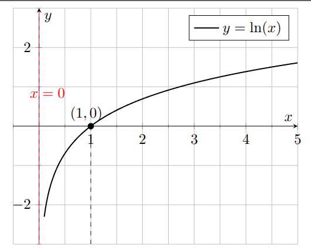

Here are **Madeline’s Exam 3 notes**, carefully crafted by someone who has a great eye to synthesize what you need to know for aceing your exams.

📄 **PDF version:**  
[Download *MATH 116 – EXAM 3* (Madeline’s Review Sheet)](MATH-116-EXAM-3.pdf)

**Exam 3 Review Problems**  
[116 Exam3 Review (Fall 2025)-1](116-Exam3-25.pdf)

Use them for **review and practice**:
- Work through problems
- Check each topic
- Let yourself make mistakes now, not on the exam
 
If you get stuck or something doesn’t quite click, message your TAs — that’s what we’re here for. Hope this helps and Enjoy Thanks giving.

## 1. Exponential Functions

An exponential function has the form

\[
f(x) = b^x, \quad b>0,\ b\neq 1.
\]

- If \(b > 1\) then we've got **exponential growth** 
- If \(0 < b < 1\): **exponential decay** 

**Key graph features:**

- Horizontal asymptote: \(y = 0\). Normal exponential are never negative.
- Graph never touches the \(x\)-axis.
- Always passes through \((0,1)\) because \(b^0 = 1\).

**Transformations:**

- \(f(x) = a \, b^x\)  
  - \(|a|>1\): vertical stretch  
  - \(0<|a|<1\): vertical shrink  
  - \(a<0\): reflection across the \(x\)-axis.
- \(f(x) = b^{x-h}\): horizontal shift **right** by \(h\).
- \(f(x) = b^x + k\): vertical shift **up** by \(k\).  
  - Asymptote becomes \(y = k\).

---

## 2. Logarithms

Logarithms are just **exponents in disguise**:

\[
\log_b(x) = y \quad \Longleftrightarrow \quad b^y = x.
\]

Special case: the **natural log**:

\[
\ln(x) = \log_e(x).
\]

### Log rules you must know:

- Product:
  \[
  \ln(ab) = \ln(a) + \ln(b)
  \]
- Quotient:
  \[
  \ln\!\left(\frac{a}{b}\right) = \ln(a) - \ln(b)
  \]
- Power:
  \[
  \ln(a^p) = p \ln(a)
  \]

These are your “log superpowers” for simplifying expressions and solving equations.

**Graph features of \(y = \ln x\):**

- Vertical asymptote: \(x = 0\).
- Domain: \(x > 0\).
- Passes through \((1, 0)\).

---

## 3. Solving Exponential and Log Equations

Typical strategy:

1. **Isolate** the exponential or logarithm.
2. If it’s exponential, use logs. If it’s logarithmic, change to exponential form.
3. If solving for time \(t\), you’ll almost always end up using **\(\ln\)**.
4. Use log rules to **bring exponents down**.
5. Solve for the variable like a normal algebra equation.

**Important tips:**

- If you can rewrite both sides with the **same base**, set exponents equal.
  
  $$b^{\text{something}} = b^{\text{something\_else}}.$$
  
  Then,
  $$
  \text{something} = \text{something else}
  $$
- If the bases **do not** match nicely → use \(\ln\) (or \(\log\).

---

## 4. Compound Interest

Money stuff! The standard formula (compounded a finite number of times per year):

\[
A = P \left(1 + \frac{r}{n}\right)^{nt},
\]

where  
- \(P\): principal (starting amount)  
- \(r\): annual interest rate (as a **decimal**)  
- \(n\): number of compounding periods per year  
- \(t\): time in years  
- \(A\): final amount (the “after” picture)

**Continuously compounded interest:**

\[
A = P e^{rt}.
\]

If you see the word “continuously,” your reflex should be: *“That’s an \(e^{rt}\) situation.”*

---

## 5. Effective Annual Rate

The **effective annual rate** says: “If I had just one compounding per year, what single rate would give the same result?”

- If interest is compounded \(n\) times per year:

  \[
  r_{\text{eff}} = \left(1 + \frac{r}{n}\right)^n - 1
  \]

- If interest is compounded continuously:

  \[
  r_{\text{eff}} = e^r - 1
  \]

**Interpretation:**  
Bigger \(r_{\text{eff}}\) = better investment (for you). Worse for your credit card bill.

---

## 6. Derivatives of Exponential and Log Functions

Core derivative facts to memorize:

- \[
  \frac{d}{dx}\big[e^x\big] = e^x
  \]
- \[
  \frac{d}{dx}\big[a^x\big] = a^x \ln(a), \quad a>0,\ a\neq1
  \]
- \[
  \frac{d}{dx}\big[\ln(x)\big] = \frac{1}{x}, \quad x>0
  \]

**Chain rule forms:**

- \[
  \frac{d}{dx}\big[e^{g(x)}\big] = g'(x)\, e^{g(x)}
  \]
- \[
  \frac{d}{dx}\big[\ln(g(x))\big] = \frac{g'(x)}{g(x)}
  \]

And just like on **Exam 2**, be ready to combine:

- Product rule  
- Quotient rule  
- Chain rule  

---

## 7. Antiderivatives (Indefinite Integrals)

Antiderivatives are “derivatives in reverse.” General formulas:

- For \(n \neq -1\):
  \[
  \int x^n \, dx = \frac{x^{n+1}}{n+1} + C
  \]
- Exponential base \(e\):
  \[
  \int e^x \, dx = e^x + C
  \]
- Exponential base \(a\):
  \[
  \int a^x \, dx = \frac{a^x}{\ln(a)} + C, \quad a>0,\ a\neq1
  \]
- Log-type integrand:
  \[
  \int \frac{1}{x} \, dx = \ln|x| + C
  \]

**Pro-tip:**  
Take the derivative of your answer to check:

\[
\frac{d}{dx}\big(\text{your antiderivative}\big) \stackrel{?}{=} \text{original function}.
\]

If yes → happy dance. If no → find where you made a mistake.

---

## 8. Approximating Area (Riemann Sums)

Idea: Approximate area under the curve using **rectangles**.

On interval \([a,b]\) with \(n\) rectangles:

\[
\Delta x = \frac{b - a}{n}
\]

Then area is approximately:

\[
\text{Area}  = \text{(height)} \cdot \text{width}
\]

The **height** depends on which method:

- **Left endpoints:**  
 
- **Right endpoints:**  
  
- **Midpoints:**  

---

## 9. Fundamental Theorem of Calculus (FTC)

This is the bridge between **derivatives** and **integrals**.

### FTC Part 2

If \(F\) is an antiderivative of \(f\), then

\[
\int_a^b f(x)\,dx = F(b) - F(a).
\]

So to compute a definite integral:

1. Find an antiderivative \(F(x)\).
2. Plug in the upper limit and lower limit:
   \[
   F(b) - F(a).
   \]

### Net Change Formula

If \(F\) is some “quantity” whose rate of change is \(F'(x) = f(x)\), then

\[
F(b) = F(a) + \int_a^b f(x)\,dx.
\]

Interpretation:  
> New amount = old amount + total accumulated change.

This shows up in **“total change”** problems: total distance traveled, total money earned, total water pumped, etc.

---