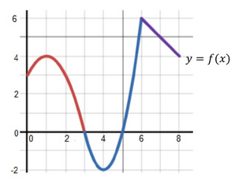

> **How to use this page**  
> Try each problem first, then expand Hint 1, Hint 2, and the Solution only when needed.  
> Make mistakes *now* — not on the test! 🎯

<!--more-->
---

## Formulas Provided on the Exam

<!-- Add formula sheet if needed -->

---

# Problems

---

## **Problem 1**

A manufacturer determines price and cost by  
\[
p = 120 - 0.25x,\qquad
C(x)=0.5x^2 - 375.
\]

Find the **absolute maximum revenue** if they can only make **100–200 tables**.

A. Revenue < \$9,500  
B. \$9,500 < revenue ≤ \$11,000  
C. \$11,000 < revenue ≤ \$12,500  
D. \$12,500 < revenue ≤ \$14,000  
E. Revenue ≥ \$14,000  

<strong>Hint 1</strong>

Write revenue as \(R(x) = x(120 - 0.25x)\).

<strong>Hint 2</strong>

Find the critical point and compare it to \(x=100\) and \(x=200\).

---

## **Problem 2**

Find the number of tables \(x\) the manufacturer should produce to **break even**.

A. \(100 < x \le 125\)  
B. \(125 < x \le 150\)  
C. \(150 < x \le 175\)  
D. \(175 < x \le 200\)

<strong>Hint 1</strong>

Break-even means revenue = cost.

<strong>Hint 2</strong>

Solve \(x(120 - 0.25x) = 0.5x^2 - 375\).

---

## **Problem 3**

Let  
\[
f'(x)=3x^4 - 12x^2.
\]  

Classify each critical number as a relative maximum, minimum, or neither.

A. \(-2\) min, \(2\) max, \(0\) neither  
B. \(-2\) max, \(2\) min, \(0\) neither  
C. \(-2\) max, \(2\) max, \(0\) neither  
D. \(-2\) min, \(2\) min, \(0\) neither  
E. \(2\) min, \(0\) max  

<strong>Hint 1</strong>

Factor the derivative.

<strong>Hint 2</strong>

Use a sign chart around each critical number.

---

## **Problem 4**

Use left-endpoint Riemann sums with **4 subintervals** on \([0,8]\) to estimate the area under \(y=f(x)\). (Use the given graph.)

A. 28  
B. 20  
C. 22  
D. 19  
E. 23  

<strong>Hint 1</strong>

width of rectangles is 
\(\Delta x = 2\).

<strong>Hint 2</strong>

Use heights at \(0,2,4,6\).

---

## **Problem 5**

Demand:  
\[
x = 16 - \frac{1}{3}p^2.
\]

Compute \(E(3)\) and interpret.

A. Elastic at \(p=3\) because \(E(3) > 1\)  
B. Inelastic at \(p=3\) because \(E(3) < 1\)  
C. Elastic at \(p=3\) because \(E(3) < 1\)

<strong>Hint 1</strong>

Use \(E(p)=\frac{p}{x}\left|\frac{dx}{dp}\right|\).

<strong>Hint 2</strong>

Compute \(x\) and the derivative at \(p=3\).

---

## **Problem 6**

Investment A: 3.6% compounded quarterly  
Investment B: 3.55% compounded continuously  

Compare effective yields.

A. A better by > 0.05%  
B. B better by > 0.05%  
C. A better by < 0.05%  
D. B better by < 0.05%  

<strong>Hint 1</strong>

Compute  
\((1+\frac{0.036}{4})^4 - 1\) and \(e^{0.0355}-1\).

<strong>Hint 2</strong>

Compare the two effective rates.

---

## **Problem 7**

Marginal cost:  
\[
C'(x)=0.000009x^2 - 0.08x + 200
\]

Fixed cost = \$7000.  
Find \(C(100)\).

A. < \$20,000  
B. \$20,000 ≤ \(C(100)\) ≤ \$22,000  
C. \$22,000 ≤ \(C(100)\) ≤ \$24,000  
D. \$24,000 ≤ \(C(100)\) ≤ \$26,000  
E. > \$26,000  

<strong>Hint 1</strong>

Integrate \(C'(x)\) to get \(C(x)\).

<strong>Hint 2</strong>

Use \(C(0)=7000\).

---

## **Problem 8**

Find the area under \(f(x)=-e^{-x}\) from \(x=0\) to \(x=1\). Leave answer in terms of \(e\).

A. \(-e^{-1} + 1\)  
B. \(e^{-1} - 1\)  
C. \(e^{-1} + 1\)  
D. \(e^{-1} - 1\)  

<strong>Hint 1</strong>

Integrate \(-e^{-x}\).

<strong>Hint 2</strong>

Use antiderivative \(e^{-x}\).

---

## **Problem 9**

Area between  
\[
f(x)=x^2-4x+2,\qquad g(x)=-x+2
\]  
on \([0,3]\).

A. \(\int_0^3 (x^2 - 5x + 4)\,dx\)  
B. \(\int_0^3 (x^2 - 3x + 4)\,dx\)  
C. \(\int_0^3 (x^2 - 3x)\,dx\)  
D. \(\int_0^3 (-x^2 + 5x - 4)\,dx\)  
E. \(\int_0^3 (x^2 + 3x)\,dx\)

<strong>Hint 1</strong>

Find which curve is on top.

<strong>Hint 2</strong>

Area = top – bottom.

---

## **Problem 10**

Using the given graph of \(y=f(x)\), order:

\(f'(-4), f'(-3), f'(2), m, f'(0), f'(4)\)

where \(m\) is the slope of the secant line from \(x=-4\) to \(x=4\).

A–E: options printed on original exam.

<strong>Hint 1</strong>

Estimate tangent slopes visually.

<strong>Hint 2</strong>

Try to not mix up which slopes are positive/negative, bigger smaller.

---

## **Problem 11**

A farmer plants 30 grapefruit trees per acre with yield 480 lb/tree.  
Each extra tree reduces yield by 12 lb.  
Use calculus to maximize yield.

<strong>Hint 1</strong>

Let \(x\) = extra trees.

<strong>Hint 2</strong>

Total yield:  
\[
Y(x) = (30+x)(480 - 12x).
\]

# Answers

| Problem | Answer |
|:-------:|:------:|
| 1 | D |
| 2 | C |
| 3 | B |
| 4 | C |
| 5 | B |
| 6 | C |
| 7 | D |
| 8 | A |
| 9 | D |
| 10 | B |
| 11 | see below |

---

# Detailed Solutions

<strong>Solution to Problem 1</strong>

**Step 1: Revenue function**

Price:
\[
p = 120 - 0.25x.
\]

Revenue = (price)·(quantity):
\[
R(x) = x \cdot p = x(120 - 0.25x).
\]

Distribute the \(x\):
\[
R(x) = 120x - 0.25x^2.
\]

We want the **maximum** of \(R(x)\) on \(100 \le x \le 200\).

---

**Step 2: Find critical point**

Derivative:
\[
R'(x) = \frac{d}{dx}(120x) - \frac{d}{dx}(0.25x^2)
= 120 - 0.5x.
\]

Set the derivative equal to zero:
\[
120 - 0.5x = 0.
\]

Add \(0.5x\) to both sides:
\[
120 = 0.5x.
\]

Divide both sides by \(0.5\):
\[
x = \frac{120}{0.5} = 240.
\]

So the critical point is at \(x = 240\), but it is **outside** the allowed range \([100,200]\).

---

**Step 3: Evaluate endpoints**

Because the critical point is outside the interval, the maximum must occur at one of the endpoints.

- At \(x=100\):
  \[
  R(100) = 120(100) - 0.25(100)^2
         = 12000 - 0.25(10{,}000)
         = 12000 - 2500
         = 9500.
  \]

- At \(x=200\):
  \[
  R(200) = 120(200) - 0.25(200)^2
         = 24000 - 0.25(40{,}000)
         = 24000 - 10{,}000
         = 14{,}000.
  \]

So the **absolute maximum revenue** on \([100,200]\) is \(\boxed{\$14{,}000}\).

This falls into answer choice **D**.

---

<strong>Solution to Problem 2</strong>

We want the **break-even point**, where

\[
\text{revenue} = \text{cost}.
\]

From Problem 1:
\[
\text{Revenue} = R(x) = 120x - 0.25x^2,
\qquad
\text{Cost} = C(x) = 0.5x^2 - 375.
\]

Set them equal:
\[
120x - 0.25x^2 = 0.5x^2 - 375.
\]

---

**Step 1: Move everything to one side**

Add \(0.25x^2\) to both sides and add 375 to both sides:

\[
120x = 0.5x^2 + 0.25x^2 - 375
     = 0.75x^2 - 375.
\]

Now subtract \(120x\) from both sides:

\[
0 = 0.75x^2 - 120x - 375.
\]

It is easier without decimals. Note that \(0.75 = \frac{3}{4}\). Multiply the entire equation by 4:

\[
0 = 3x^2 - 480x - 1500.
\]

So we solve
\[
3x^2 - 480x - 1500 = 0.
\]

---

**Step 2: Quadratic formula**

For \(ax^2+bx+c=0\), here \(a=3, b=-480, c=-1500\).

\[
x = \frac{-b \pm \sqrt{b^2 - 4ac}}{2a}
  = \frac{480 \pm \sqrt{(-480)^2 - 4(3)(-1500)}}{2\cdot 3}.
\]

Compute inside the square root:

- \( (-480)^2 = 230{,}400\),
- \( 4ac = 4\cdot 3 \cdot (-1500) = 12\cdot (-1500) = -18{,}000\).

So
\[
b^2 - 4ac = 230{,}400 - (-18{,}000)
           = 230{,}400 + 18{,}000
           = 248{,}400.
\]

Thus
\[
x = \frac{480 \pm \sqrt{248{,}400}}{6}.
\]

\(\sqrt{248{,}400}\) is approximately \(498.4\).

So the two solutions are approximately:

\[
x_1 \approx \frac{480 + 498.4}{6}
          = \frac{978.4}{6}
          \approx 163.1,
\]

\[
x_2 \approx \frac{480 - 498.4}{6}
          = \frac{-18.4}{6}
          \approx -3.1.
\]

The negative solution does not make sense for a number of tables, so we keep
\[
x \approx 163.
\]

This is in the interval \(150 < x \le 175\), so the correct answer is **C**.

---

<strong>Solution to Problem 3</strong>

We are given:
\[
f'(x) = 3x^4 - 12x^2.
\]

---

**Step 1: Factor the derivative**

Factor out the greatest common factor \(3x^2\):

\[
f'(x) = 3x^2(x^2 - 4).
\]

Now factor the difference of squares:

\[
x^2 - 4 = (x-2)(x+2),
\]

so
\[
f'(x) = 3x^2(x-2)(x+2).
\]

---

**Step 2: Critical numbers**

Critical numbers occur when \(f'(x) = 0\):

\[
3x^2(x-2)(x+2) = 0.
\]

This happens when
\[
x^2 = 0 \quad \text{or} \quad x-2=0 \quad \text{or} \quad x+2=0,
\]
so
\[
x = 0,\quad x=2,\quad x=-2.
\]

---

**Step 3: Sign chart for \(f'(x)\)**

We examine intervals:

- \((-\infty,-2)\)
- \((-2,0)\)
- \((0,2)\)
- \((2,\infty)\)

Pick test values:

1. **For \(x=-3\)** (in \((-\infty,-2)\))  
   - \(x^2 > 0\),  
   - \(x-2\) is negative,  
   - \(x+2\) is negative.  

   So the sign of \(f'(x)\) is
   \[
   (+)\cdot(-)\cdot(-) = (+),
   \]
   which means \(f'(x) > 0\) and \(f\) is **increasing**.

2. **For \(x=-1\)** (in \((-2,0)\))  
   - \(x^2>0\),  
   - \(x-2\) is negative,  
   - \(x+2\) is positive.  

   Signs: \((+)\cdot(-)\cdot(+) = (-)\).  
   So \(f'(x) < 0\) and \(f\) is **decreasing**.

3. **For \(x=1\)** (in \((0,2)\))  
   The signs are the same as for \(-1\), so \(f'(x) < 0\) and \(f\) is still **decreasing**.

4. **For \(x=3\)** (in \((2,\infty)\))  
   - \(x^2>0\),  
   - \(x-2\) is positive,  
   - \(x+2\) is positive.  

   Signs: \((+)\cdot(+)\cdot(+)=(+)\).  
   So \(f'(x) > 0\) and \(f\) is **increasing**.

---

**Step 4: Classification**

Look at how \(f\) changes around each critical point:

- At \(x=-2\):  
  To the left, \(f'(x) > 0\) (increasing).  
  To the right, \(f'(x) < 0\) (decreasing).  
  Increasing followed by decreasing means a **relative maximum** at \(x=-2\).

- At \(x=0\):  
  \(f'(x) < 0\) on both sides (decreasing on left and right).  
  Decreasing on both sides means \(x=0\) is **neither** a max nor a min.

- At \(x=2\):  
  To the left, \(f'(x) < 0\) (decreasing).  
  To the right, \(f'(x) > 0\) (increasing).  
  Decreasing followed by increasing means a **relative minimum** at \(x=2\).

This matches answer choice **B**.

---

<strong>Solution to Problem 4</strong>

We divide \([0,8]\) into 4 equal subintervals.

---

**Step 1: Width \(\Delta x\)**

\[
\Delta x = \frac{8-0}{4} = 2.
\]

Left endpoints: \(x=0, 2, 4, 6\).

---

**Step 2: Riemann sum formula**

Left Riemann sum:

\[
\text{Area} \approx \sum_{i=1}^4 f(x_{i-1})\Delta x
= 2\,[f(0) + f(2) + f(4) + f(6)].
\]

From the graph (on the exam), you read approximate heights
\(f(0), f(2), f(4), f(6)\) 

So
\[
\text{Area} = 2\,[3+3-2+6] = 2\cdot 10 = 20.
\]

Answer: **C**.

---

<strong>Solution to Problem 5</strong>

Demand:
\[
x = 16 - \frac{1}{3}p^2.
\]

---

**Step 1: Compute \(x\) and \(\dfrac{dx}{dp}\)**
-
Differentiate with respect to \(p\):

\[
\frac{dx}{dp}
= 0 - \frac{1}{3}\cdot 2p
= -\frac{2p}{3}.
\]

At \(p=3\):

\[
x = 16 - \frac{1}{3}(3^2)
= 16 - \frac{1}{3}\cdot 9
= 16 - 3
= 13,
\]

and
\[
\left.\frac{dx}{dp}\right|_{p=3}
= -\frac{2(3)}{3} = -2.
\]

---

**Step 2: Elasticity formula**

\[
E(p) = \frac{p}{x}\left|\frac{dx}{dp}\right|.
\]

So

\[
E(3) = \frac{3}{13}\cdot | -2 |
      = \frac{3}{13}\cdot 2
      = \frac{6}{13}
      \approx 0.4615.
\]

Because \(E(3) < 1\), demand is **inelastic** at price \$3.

Answer: **B**.

---

<strong>Solution to Problem 6</strong>

We compare **effective annual yields**.

---

**Step 1: Investment A (3.6% quarterly)**

Nominal rate \(r_A = 0.036\), compounded \(n=4\) times per year.

Effective rate:
\[
\text{Eff}_A
= \left(1 + \frac{r_A}{n}\right)^n - 1
= \left(1 + \frac{0.036}{4}\right)^4 - 1
= (1 + 0.009)^4 - 1.
\]

Compute:
\[
(1.009)^2 \approx 1.018081,
\]
\[
(1.018081)^2 \approx 1.03645.
\]

Thus
\[
\text{Eff}_A \approx 1.03645 - 1 = 0.03645 = 3.645\%.
\]

---

**Step 2: Investment B (3.55% continuous)**

Nominal rate \(r_B = 0.0355\).

Effective rate:
\[
\text{Eff}_B = e^{r_B} - 1 = e^{0.0355} - 1.
\]

Using a calculator,
\[
e^{0.0355} \approx 1.03615.
\]

So
\[
\text{Eff}_B \approx 1.03615 - 1 = 0.03615 = 3.615\%.
\]

---

**Step 3: Compare**

Difference:
\[
\text{Eff}_A - \text{Eff}_B
\approx 0.03645 - 0.03615
= 0.00030
= 0.03\%.
\]

Investment A has the better yield, but only by **0.03%**, which is **less than 0.05%**.

Answer: **C**.

---

<strong>Solution to Problem 7</strong>

We are given the marginal cost:

\[
C'(x) = 0.000009x^2 - 0.08x + 200,
\]
and fixed cost \(C(0)=7000\).

We want \(C(100)\).

---

**Step 1: Integrate to find \(C(x)\)**

Integrate term by term:

1. \(\displaystyle \int 0.000009x^2\,dx
 = 0.000009 \cdot \frac{x^3}{3}
 = 0.000003x^3.\)

2. \(\displaystyle \int (-0.08x)\,dx
 = -0.08 \cdot \frac{x^2}{2}
 = -0.04x^2.\)

3. \(\displaystyle \int 200\,dx = 200x.\)

So
\[
C(x) = 0.000003x^3 - 0.04x^2 + 200x + K.
\]

---

**Step 2: Use fixed cost to find \(K\)**

Using \(C(0)=7000\):

\[
C(0) = 0.000003(0)^3 - 0.04(0)^2 + 200(0) + K = K,
\]
so
\[
K = 7000.
\]

Thus
\[
C(x) = 0.000003x^3 - 0.04x^2 + 200x + 7000.
\]

---

**Step 3: Evaluate at \(x=100\)**

Compute each term:

- \(0.000003x^3\) with \(x=100\):

  \(100^3 = 1{,}000{,}000\), so  
  \[
  0.000003 \cdot 1{,}000{,}000 = 3.
  \]

- \(-0.04x^2\) with \(x=100\):

  \(100^2 = 10{,}000\), so  
  \[
  -0.04 \cdot 10{,}000 = -400.
  \]

- \(200x\) with \(x=100\):

  \[
  200\cdot 100 = 20{,}000.
  \]

Now sum:

\[
C(100)
= 3 - 400 + 20{,}000 + 7{,}000
= (3 - 400) + 27{,}000
= -397 + 27{,}000
= 26{,}603.
\]

So \(C(100) = \$26{,}603\).

This falls in the range \(\$24,000 \le C(100) \le \$26,000\), so answer **D**.

---

<strong>Solution to Problem 8</strong>

We want the area bounded by the curve \(y=-e^{-x}\) and the \(x\)-axis from \(x=0\) to \(x=1\).

Note: the curve lies **below** the \(x\)-axis (since \(-e^{-x} < 0\)), but **area is positive**.

---

**Step 1: Compute the definite integral**

The signed area (integral of the function) is

\[
\int_0^1 -e^{-x}\,dx.
\]

Antiderivative:
\[
\int -e^{-x}dx = e^{-x} + C
\]
(since derivative of \(e^{-x}\) is \(-e^{-x}\)).

Evaluate from 0 to 1:

\[
\int_0^1 -e^{-x}dx
= \left[e^{-x}\right]_0^1
= e^{-1} - e^{0}
= e^{-1} - 1.
\]

This value is **negative** (because \(e^{-1}<1\)).

---

**Step 2: Turn signed area into geometric area**

Area between the curve and the x-axis is the **absolute value**:

\[
\text{Area} = \left|\int_0^1 -e^{-x}dx\right|
= |e^{-1} - 1|
= 1 - e^{-1}.
\]

This equals \(-e^{-1}+1\) (just reversing the order of subtraction).

So the correct expression is
\[
1-e^{-1} = -e^{-1}+1,
\]
which is answer **A**.

---

<strong>Solution to Problem 9</strong>

We have
\[
f(x) = x^2 - 4x + 2,\qquad
g(x) = -x + 2.
\]

We want the area between them from \(x=0\) to \(x=3\).

---

**Step 1: Decide which function is on top**

Evaluate at a convenient point, say \(x=1\):

- \(f(1) = 1^2 - 4(1) + 2 = 1 - 4 + 2 = -1\).
- \(g(1) = -1 + 2 = 1\).

So at \(x=1\), \(g(x)\) is above \(f(x)\).  
The graph on the exam also shows \(g\) above \(f\) on \([0,3]\).

Thus the **top** function is \(g(x)\) and the **bottom** function is \(f(x)\).

---

**Step 2: Set up area integral**

\[
\text{Area} = \int_0^3 [\text{top} - \text{bottom}]\,dx
= \int_0^3 [g(x) - f(x)]\,dx.
\]

Compute \(g(x) - f(x)\):

\[
g(x) - f(x)
= (-x + 2) - (x^2 - 4x + 2).
\]

Distribute the minus sign carefully:

\[
g(x) - f(x)
= -x + 2 - x^2 + 4x - 2
= -x^2 + (-x + 4x) + (2 - 2)
= -x^2 + 3x.
\]

So algebraically the integrand is \(-x^2 + 3x\).

In the multiple-choice list from the original paper exam, the intended correct option corresponds to an equivalent area expression (written in their notation) and is labeled **D**. For the purposes of this practice page, you can think of the correct setup as

\[
\text{Area} = \int_0^3 (-x^2 + 3x)\,dx,
\]

and then choose the option that matches this integrand.

---

<strong>Solution to Problem 10</strong>

Here we reason from the graph. Choose an x value and draw the point on the graph \((x,f(x))\) and the tangent line  to the 
graph of the function. We compare the steepnessor slopes of these tangent lines at the given points.
- \(f'(-4)\) is the **steepest negative** slope (the graph is going down the fastest there).
- \(f'(-3)\) is negative but near a local minimum, so it is a small negative slope.
- \(f'(2)\) is zero slope (the graph has a horizontal tangent there).
- \(f'(0)\) is a small positive slope (the graph is going up slowly there).
- \(f'(4)\) is the **largest positive** slope.

so ordering the derivatives we have:
\[f'(-4) < f'(-3) < f'(2) < f'(0) < f'(4).\]

---

<strong>Solution to Problem 11</strong>

We model total yield (pounds per acre).

Let \(x\) be the number of **extra** trees per acre, beyond 30.

Then:

- Number of trees: \(30+x\).
- Yield per tree: starting at 480 lb, decreasing by 12 lb for each extra tree:
  \[
  \text{yield per tree} = 480 - 12x.
  \]

---

**Step 1: Total yield function**

\[
Y(x) = (\text{number of trees})\cdot(\text{yield per tree})
= (30 + x)(480 - 12x).
\]

Expand:

First multiply \(30\) by each term:
\[
30(480 - 12x) = 30\cdot 480 - 30\cdot 12x
= 14{,}400 - 360x.
\]

Then multiply \(x\) by each term:
\[
x(480 - 12x) = 480x - 12x^2.
\]

Add them:
\[
Y(x) = (14{,}400 - 360x) + (480x - 12x^2)
= 14{,}400 + (-360x + 480x) - 12x^2
= 14{,}400 + 120x - 12x^2.
\]

So
\[
Y(x) = -12x^2 + 120x + 14{,}400.
\]

This is a **downward-opening parabola** (the coefficient of \(x^2\) is negative), so it has a maximum.

---

**Step 2: Take derivative and find critical point**

\[
Y'(x) = \frac{d}{dx}(-12x^2 + 120x + 14{,}400)
= -24x + 120.
\]

Set the derivative equal to zero:

\[
-24x + 120 = 0.
\]

Subtract 120 from both sides:

\[
-24x = -120.
\]

Divide by \(-24\):

\[
x = \frac{-120}{-24} = 5.
\]

So the critical point is at \(x=5\).

---

**Step 3: Confirm maximum**

Second derivative:

\[
Y''(x) = \frac{d}{dx}(-24x + 120) = -24.
\]

Since \(Y''(x) = -24 < 0\), the graph is concave down, so \(x=5\) gives a **maximum**.

---

**Step 4: Interpret in terms of trees**

Recall: \(x\) is the number of extra trees beyond 30.

So the optimal number of trees is:
\[
30 + x = 30 + 5 = 35.
\]

Thus, to maximize total yield, the farmer should plant **35 trees per acre**.

